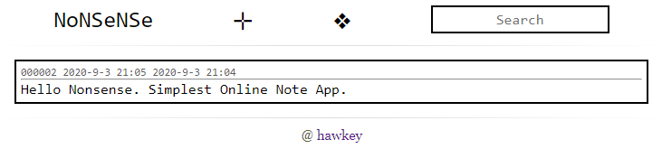
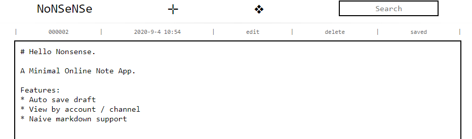

# NoNSeNSe

React Frontend for Nonsense, a minimal online note App.

Hosted by [listener](https://github.com/ashawkey/listener.git) @ hawia project.


### [Demo](https://hawia.xyz/nonsense/)

(You should create your own channel in ❖ first)


##### Home page



##### Editor page




### Develop

* change `API_ROOT` in `const.js` to local port
* ```npm run start```

### Deploy

* change `API_ROOT` in `const.js` to remote server port
* ```npm run build```
* copy built files to remote server and use nginx to hold them / for gh-pages jsut run ```npm run deploy```


### Change Log
* [2021-9-12] replace former markdown editor with [Milkdown](https://github.com/Saul-Mirone/milkdown).